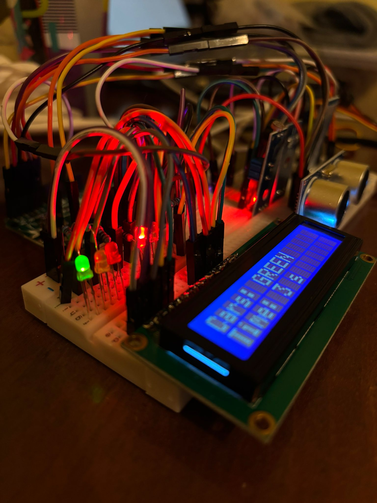
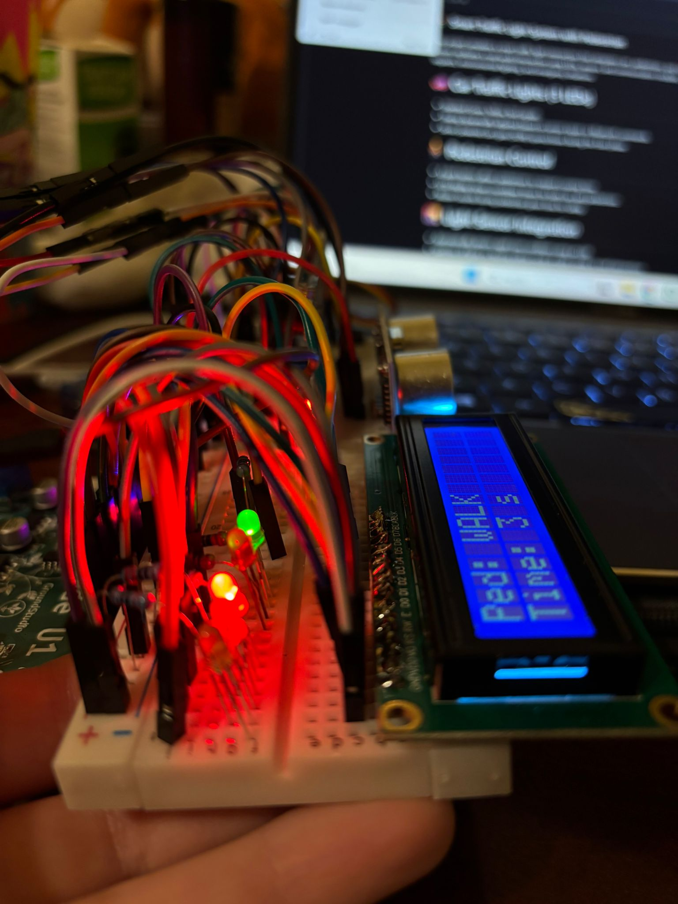
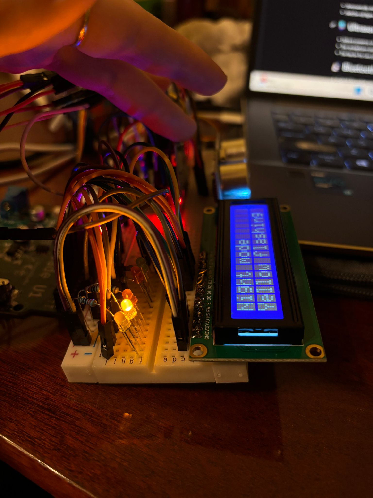
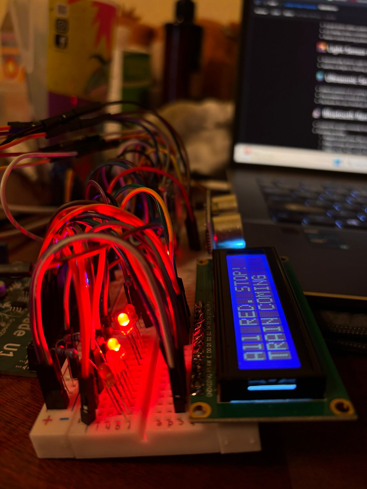
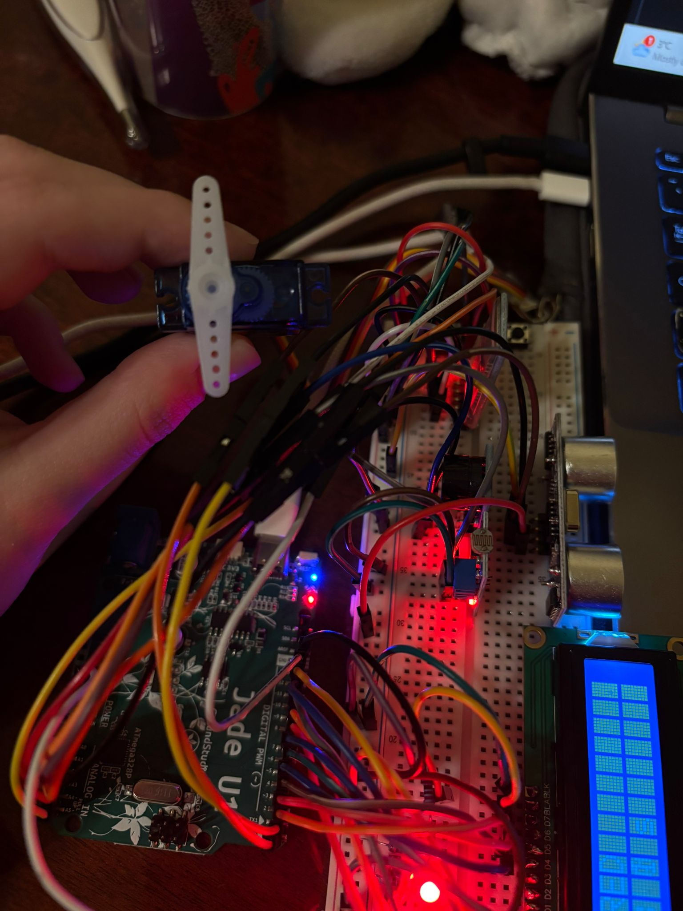
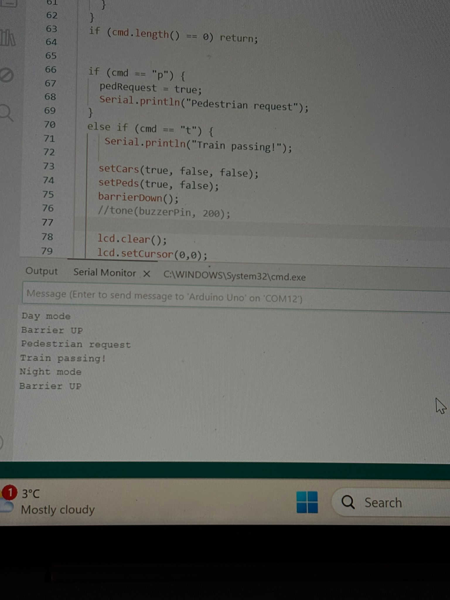

## 🚦 Smart Traffic Light System with Pedestrian
This project simulates a smart traffic light intersection that integrates cars, pedestrians, and smart sensors to improve safety and efficiency. The system replicates a real-world intersection using LEDs, sensors, and communication modules, and can respond dynamically to pedestrian requests and environmental lighting.

# 🚗 Car Traffic Lights (3 LEDs)

- Standard Green, Yellow, Red signals.
- Timing dynamically adjusted based on sensor inputs or Bluetooth commands.
- Servo-powered cars gate (SG90) opens/closes during the train phase.

# 🚶 Pedestrian Control

- A push button allows pedestrians to request crossing time.
- LCD display shows countdown timers for both cars and pedestrians.
- Buzzer sounds during pedestrian green time for safety.

# 🌇 Light Sensor Integration

- Automatically detects night-time conditions using an LDR
- Switches all lights to flashing yellow mode at night, similar to real intersections

# 🚆 Ultrasonic Sensor Detection
- Detects presence of a coming train.
- The semaphores should all turn red
- The barrier for cars should go down

# 🔄 Servo Motor Control (Car Barrier System)
- A micro servo (SG90) is used to simulate a railway-style barrier for vehicles
- Normally stays in the open position, allowing cars to pass
- When a train is detected (ultrasonic sensor or Bluetooth 't' command):
  - All traffic lights turn red
  - The servo rotates to the closed position, lowering the barrier
- After the train passes, the servo returns to open and normal operation resumes

# 📡 Bluetooth Remote Control (JDY24M Bluetooth 5.0)

- Control the system remotely from a smartphone via a serial terminal app.
- Functions include:
  - Request a ped phase (like pressing the button): command 'p'
  - Adjust timings (green/yellow/ped times): commands 'cg', 'cy', 'pg', 'ar'
  - Trigger a test “train” event (for demo): command 't'
  - Ask for status (what mode we are in): command 's'

 

## 🧰 Bill of Materials

# 🔌 Control & Power
 1. Microcontroller board – Jade U1
 2. Breadboard – 830 pts
 3. Jumper wires – 30+ male–male, 15 male–female

# 🚦 Traffic & Pedestrian Lights
 1.  LEDs: 2× red, 2× green, 1× yellow 
 2.  Resistors 220 Ω – 5 pcs
 3.  Buzzer module
 4.   Micro servo (SG90)

# 🚶 User Interaction
 1.  Pedestrian push button
 2.   Emergency button
 3.    10 kΩ resistors (×2)

# 🌇 Sensors & Smart Logic
 1.  LDR (photoresistor)
 2.  Ultrasonic sensor (HC-SR04)
 3.  Fixed resistor for LDR divider – 10 kΩ

# 📟 Display
 1. 16×2 LCD module

# 📡 Bluetooth & Logic
 1. Bluetooth module (JDY24M Bluetooth 5.0)
 2. Voltage divider resistors for RX pin: 1 kΩ + 2 kΩ 

